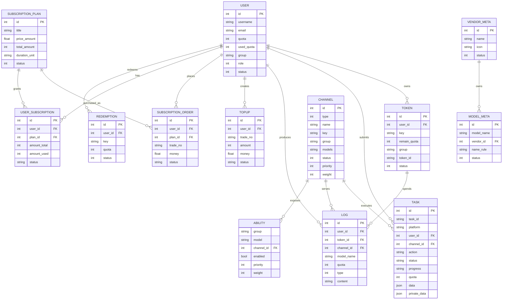
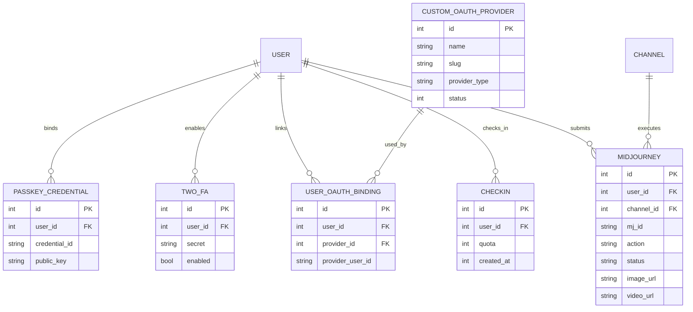
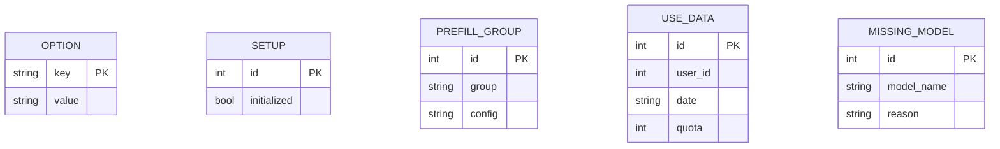
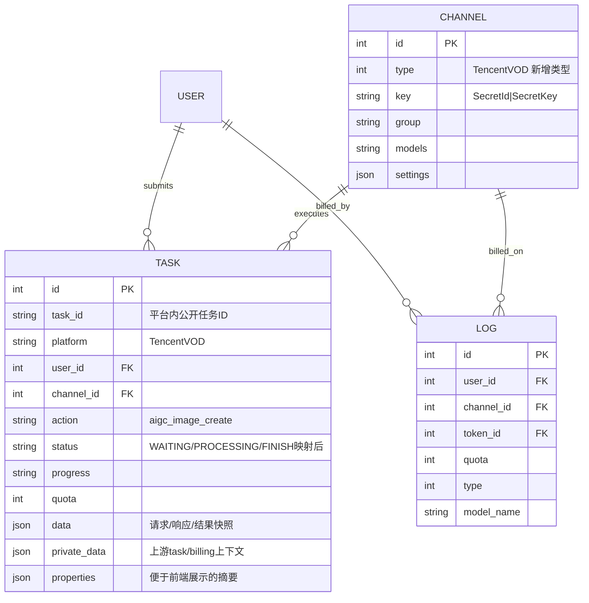
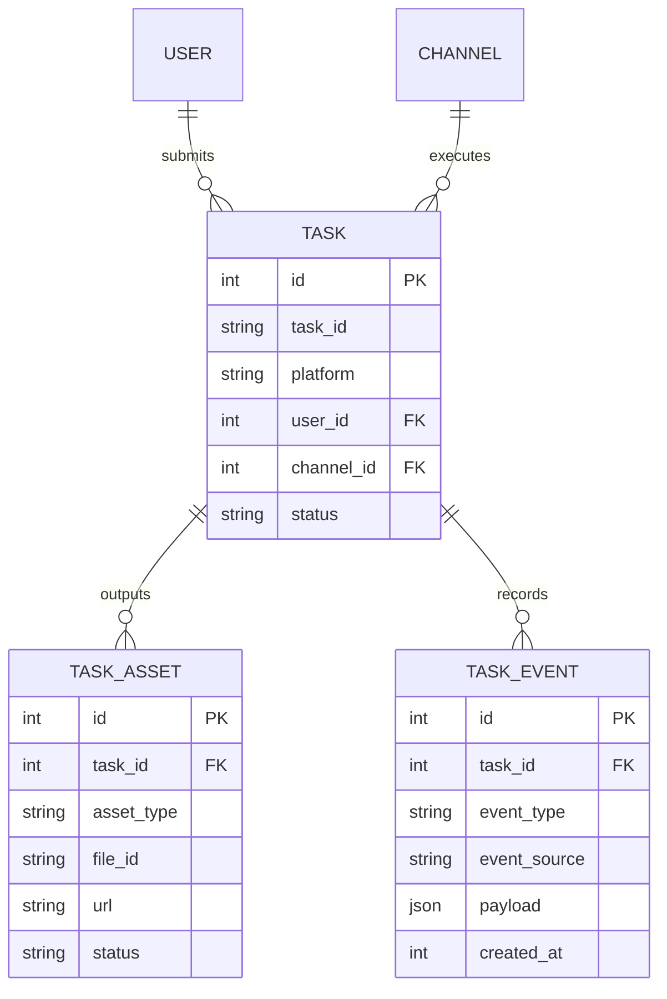

# 当前项目全量 ER 草图 + Tencent VOD 扩展草图

## 说明

- 本文基于当前仓库 `model/` 目录、任务链路、渠道注册点与已完成的只读研究整理。
- 这里的“全量”指**业务上会落库、会影响关系判断、值得纳入系统认知**的实体；`*_cache.go`、测试文件、纯工具文件不纳入 ER。
- 当前讨论前提已经锁定为：**Tencent VOD 首版采用“仅用户隔离”**，不引入多 workspace 维度。

---

## 一、当前项目全量 ER 草图（主干业务层）




### 主干理解

- **User 是中心实体**：配额、角色、组、订阅、任务、日志、充值都围绕用户展开。
- **Channel + Ability 是路由核心**：`Channel` 表示上游渠道配置，`Ability(group+model+channel)` 表示“某组用户可以通过哪个渠道访问哪个模型”。
- **Task 是异步任务中心**：当前 Suno / 视频类任务已经落在这里，Tencent VOD 最适合继续挂在这条线上。
- **Log 与 Task 是两条并行账务视图**：`Log` 更像消费/退款流水，`Task` 更像异步任务生命周期记录，二者并不是严格一对一外键绑定。

---

## 二、当前项目全量 ER 草图（认证 / 安全 / 辅助能力）




### 这层的意义

- **Passkey / 2FA / OAuth Binding**：是用户认证体系的外挂层，不影响 Tencent VOD 主链路，但影响工作台登录与权限边界。
- **Midjourney**：是历史上偏专用的任务表，说明仓库里既有“通用 Task 路线”，也存在“专用任务表路线”。这对 Tencent VOD 是个重要参考：
  - 如果需求通用、可复用、多平台共享，优先走 `Task`；
  - 如果某平台产物结构特别复杂，才考虑独立扩表。

---

## 三、当前项目全量 ER 草图（配置 / 运营 / 元数据补充层）




### 这层的意义

- 这些表更多服务于**运营、初始化、面板配置、数据统计**。
- 对 Tencent VOD 直接影响最大的其实不是这些表，而是：
  - `OPTION`：未来可能存开关或默认策略；
  - `USE_DATA` / `LOG`：未来若做单独任务成本统计，可能需要联动。

---

## 四、实体与文件映射（便于你建立源码概念）


| 领域              | 实体                                                      | 主要文件                                                             |
| --------------- | ------------------------------------------------------- | ---------------------------------------------------------------- |
| 用户与权限           | User                                                    | `model/user.go`                                                  |
| 令牌              | Token                                                   | `model/token.go`                                                 |
| 渠道              | Channel                                                 | `model/channel.go`                                               |
| 路由能力            | Ability                                                 | `model/ability.go`                                               |
| 异步任务            | Task                                                    | `model/task.go`                                                  |
| 调用日志            | Log                                                     | `model/log.go`                                                   |
| 充值              | TopUp                                                   | `model/topup.go`                                                 |
| 订阅              | SubscriptionPlan / SubscriptionOrder / UserSubscription | `model/subscription.go`                                          |
| 兑换码             | Redemption                                              | `model/redemption.go`                                            |
| 模型元数据           | ModelMeta                                               | `model/model_meta.go`                                            |
| 供应商元数据          | VendorMeta                                              | `model/vendor_meta.go`                                           |
| Passkey         | PasskeyCredential                                       | `model/passkey.go`                                               |
| 双因子             | TwoFA                                                   | `model/twofa.go`                                                 |
| OAuth 绑定        | UserOAuthBinding / CustomOAuthProvider                  | `model/user_oauth_binding.go` / `model/custom_oauth_provider.go` |
| Checkin         | Checkin                                                 | `model/checkin.go`                                               |
| Midjourney 专用任务 | Midjourney                                              | `model/midjourney.go`                                            |
| 配置              | Option / Setup                                          | `model/option.go` / `model/setup.go`                             |
| 预填充分组           | PrefillGroup                                            | `model/prefill_group.go`                                         |
| 使用数据            | UseData                                                 | `model/usedata.go`                                               |


---

## 五、ER 实体释义总表（建议你先看这一节）


| 实体 / Table            | 中文含义             | 它解决什么问题                                       | 核心关系                                                        | 对 Tencent VOD 是否关键                          |
| --------------------- | ---------------- | --------------------------------------------- | ----------------------------------------------------------- | ------------------------------------------- |
| `User`                | 用户主表             | 系统里的真实账号主体，承载身份、角色、总配额、所属组等                   | 1:N `Token` / `Task` / `Log` / `TopUp` / `UserSubscription` | **非常关键**：VOD 任务归属最终还是落到用户                   |
| `Token`               | API 令牌表          | 用户发请求时使用的访问密钥，控制剩余额度、分组、模型限制                  | N:1 `User`，1:N `Log`                                        | **中等关键**：若 VOD 也走 token 计费，就会关联             |
| `Channel`             | 渠道配置表            | 每条上游渠道的配置中心，存 provider 类型、密钥、模型集合、优先级等        | 1:N `Task` / `Log` / `Ability`                              | **非常关键**：Tencent VOD 首先要成为一种新的 Channel Type |
| `Ability`             | 路由能力映射表          | 定义“某个 group 下哪个 model 可走哪个 channel”，是路由器的能力目录 | N:1 `Channel`（通过 `channel_id`）                              | **关键**：如果 VOD 暴露模型/能力，也会挂到这里                |
| `Task`                | 通用异步任务表          | 保存异步任务生命周期：谁提交、走哪条渠道、什么状态、什么结果、扣了多少额度         | N:1 `User`，N:1 `Channel`                                    | **核心中的核心**：Tencent VOD 最自然的接入点              |
| `Log`                 | 调用/账务日志表         | 记录消费、退款、调用结果等流水，偏“账”和“审计”                     | N:1 `User` / `Token` / `Channel`                            | **关键**：VOD 成功/失败/退款最终要落到这类流水                |
| `TopUp`               | 充值记录表            | 用户充值、支付单、金额状态跟踪                               | N:1 `User`                                                  | **低相关**：不直接参与 VOD 执行，但影响用户是否有余额             |
| `SubscriptionPlan`    | 订阅套餐模板表          | 定义套餐价格、时长、额度规则                                | 1:N `UserSubscription` / `SubscriptionOrder`                | **中等相关**：如果 VOD 也吃订阅额度，会间接关联                |
| `SubscriptionOrder`   | 订阅订单表            | 记录用户买了哪个套餐、花了多少钱、订单状态如何                       | N:1 `User` / `SubscriptionPlan`                             | **低到中等**：影响支付链，不直接影响 VOD 执行链                |
| `UserSubscription`    | 用户订阅实例表          | 用户当前生效中的订阅额度池                                 | N:1 `User` / `SubscriptionPlan`                             | **中等相关**：若 VOD 扣订阅额度，会在这里结算                 |
| `Redemption`          | 兑换码表             | 兑换额度或活动权益                                     | N:1 `User`（兑换后）                                             | **低相关**                                     |
| `VendorMeta`          | 供应商元数据表          | 给供应商做展示层元信息，如名称、图标、状态                         | 1:N `ModelMeta`                                             | **低相关**：更多是运营/展示语义                          |
| `ModelMeta`           | 模型元数据表           | 管理系统内模型名、展示名、厂商归属、规则等                         | N:1 `VendorMeta`                                            | **中等关键**：如果要把 VOD 能力以模型方式暴露，会影响这里           |
| `PasskeyCredential`   | Passkey 凭据表      | 存 WebAuthn / Passkey 登录凭据                     | N:1 `User`                                                  | **无直接关系**                                   |
| `TwoFA`               | 双因子配置表           | 存 2FA 的启用状态和密钥                                | N:1 `User`                                                  | **无直接关系**                                   |
| `UserOAuthBinding`    | 用户 OAuth 绑定表     | 存用户与 GitHub/Discord/OIDC 等外部身份的绑定             | N:1 `User` / `CustomOAuthProvider`                          | **无直接关系**                                   |
| `CustomOAuthProvider` | 自定义 OAuth 提供商表   | 管理自定义 OAuth 登录源配置                             | 1:N `UserOAuthBinding`                                      | **无直接关系**                                   |
| `Checkin`             | 签到记录表            | 日常签到送额度                                       | N:1 `User`                                                  | **无直接关系**                                   |
| `Midjourney`          | Midjourney 专用任务表 | 历史原因下为 MJ 单独建的专用任务存储                          | N:1 `User` / `Channel`                                      | **高参考价值**：说明仓库允许“专表路线”，但 VOD 首版未必需要复制这条路    |
| `Option`              | 全局配置键值表          | 全局系统设置、面板配置、开关参数                              | 近似独立                                                        | **中等相关**：未来可放 VOD 全局开关/默认策略                 |
| `Setup`               | 初始化状态表           | 标记系统是否完成初始化                                   | 近似独立                                                        | **无直接关系**                                   |
| `PrefillGroup`        | 预填充分组表           | 给某些 group 提供默认配置/预填内容                         | 近似按 `group` 工作                                              | **低相关**                                     |
| `UseData`             | 用量统计表            | 对日期/用户维度做额度统计                                 | 通常与 `User` 关联                                               | **中等相关**：若后面要看 VOD 用量报表，可能会联动               |
| `MissingModel`        | 缺失模型记录表          | 记录系统发现但未纳管的模型信息                               | 独立元数据                                                       | **低相关**                                     |


### 怎么读这张表

- 想理解“**系统围着谁转**”：先看 `User`、`Channel`、`Task`、`Log`。
- 想理解“**请求怎么路由到上游**”：看 `Channel` + `Ability`。
- 想理解“**钱怎么扣、失败怎么退**”：看 `Task` + `Log` + `Token` + `UserSubscription`。
- 想理解“**Tencent VOD 挂在哪**”：先看 `Channel`，再看 `Task`。

---

## 六、Tencent VOD 接入后的推荐 ER（首版：仅用户隔离）

### 推荐原则

在当前前提下，**不建议首版就新建独立的 `tencent_vod_task` 表**。推荐优先复用：

- `Channel`：新增一种渠道类型 `Tencent VOD`
- `Task`：继续作为异步任务中心
- `Log`：继续承载计费/退款流水

也就是说，**VOD 扩展后的 ER 关系本身不会大变，变化的是 `Channel` 的一种新类型，以及 `Task` 承载的业务语义更丰富。**




### 这张扩展图怎么理解

- **用户隔离仍然靠 `Task.UserId`**，不引入 workspace 新表。
- **渠道隔离仍然靠 `Task.ChannelId`**，可知道任务是由哪条 Tencent VOD 渠道执行。
- **计费流水仍然走 `Log`**，异步任务本身作为事实记录，日志作为账务记录。
- **Tencent VOD 的复杂返回字段优先放进 `Task.Data / Properties / PrivateData`**，而不是急着扩独立表。
- **结果资产首版仅保存腾讯返回的 URL / FileId**，不做自有存储同步；后续若接入自有存储，可在任务完成后追加资产后处理层。

---

## 七、Tencent VOD 字段建议落点（基于当前表结构的推荐映射）


| 腾讯字段                  | 推荐落点                                               | 原因                 |
| --------------------- | -------------------------------------------------- | ------------------ |
| `TaskId`              | `Task.PrivateData.UpstreamTaskID`                  | 上游真实任务号，适合放私有任务上下文 |
| 项目内公开任务号              | `Task.TaskID`                                      | 当前项目已有统一公开任务 ID 机制 |
| `RequestId`           | `Task.Properties` 或 `Task.PrivateData`             | 便于排障追踪             |
| `SubAppId`            | `Channel.settings` + `Task.Properties` 快照          | 渠道默认配置 + 任务执行时快照   |
| `SessionId`           | `Task.PrivateData`                                 | 去重与幂等判断            |
| `Status`              | `Task.Status`                                      | 统一状态查询入口           |
| `CreateTime`          | `Task.SubmitTime`                                  | 对齐当前任务时间字段         |
| `BeginProcessTime`    | `Task.StartTime`                                   | 对齐当前任务时间字段         |
| `FinishTime`          | `Task.FinishTime`                                  | 对齐当前任务时间字段         |
| `ErrCode` / `Message` | `Task.FailReason` + `Task.Data`                    | 前者便于快速展示，后者保留原始语义  |
| `FileId`              | `Task.Properties`                                  | 前端可读摘要             |
| 结果 URL                | `Task.ResultURL` / `Task.Properties` / `Task.Data` | 兼容现有任务详情和面板展示      |
| 原始请求参数（prompt、尺寸、模型）  | `Task.Data`                                        | 保留完整快照，方便审计和重试     |


---

## 八、Tencent VOD 强类型配置建议（首版：基础项 + 轮询策略）

### 配置落点原则

- **敏感签名材料放 `Channel.Key`**
- **结构化业务配置放 `Channel.settings` / `ChannelOtherSettings`**
- **不建议把某条业务渠道的凭据主方案写进 `.env`**

### 推荐配置拆分


| 配置项                        | 推荐落点               | 是否首版必填 | 说明                     |
| -------------------------- | ------------------ | ------ | ---------------------- |
| `secret_id`                | `Channel.Key`      | 是      | 与 `secret_key` 组成签名主凭据 |
| `secret_key`               | `Channel.Key`      | 是      | 与 `secret_id` 组成签名主凭据  |
| `region`                   | `Channel.settings` | 是      | 腾讯云接口地域，影响请求路由         |
| `sub_app_id`               | `Channel.settings` | 强烈建议   | 腾讯 VOD 应用维度隔离；新账号通常需要  |
| `default_model`            | `Channel.settings` | 是      | 首版默认模型/能力映射            |
| `polling_interval_seconds` | `Channel.settings` | 是      | 后台轮询间隔，稳定性核心参数         |
| `polling_timeout_seconds`  | `Channel.settings` | 是      | 单任务超时阈值，决定卡死任务处理       |
| `session_id_strategy`      | `Channel.settings` | 建议     | 控制幂等/去重策略              |
| `auto_query_enabled`       | `Channel.settings` | 建议     | 是否纳入后台轮询               |
| `default_resolution`       | `Channel.settings` | 可选     | 作为默认图片尺寸/规格            |


### 推荐的 Key 组织方式


| 字段            | 推荐格式      |
| ------------- | --------- |
| `Channel.Key` | `SecretId|SecretKey` |


这样做的原因是：

- 复用当前项目现有“渠道密钥串”模式；
- 让真正敏感的信息集中在 `Key` 字段；
- `Region/SubAppId/轮询策略` 这类可运营配置单独结构化，方便后台校验与后续演进。

### 推荐的强类型 settings 语义

你后面在设计 `ChannelOtherSettings` 时，Tencent VOD 首版建议至少有这样一组强类型字段：

```text
TencentVODSettings
- Region
- SubAppId
- DefaultModel
- DefaultResolution
- PollingIntervalSeconds
- PollingTimeoutSeconds
- AutoQueryEnabled
- SessionIDStrategy
```

### 为什么不是纯 JSON 散装配置

如果只是把这些配置随手塞进 `settings` JSON：

- 后台很难做字段级校验；
- 前端表单提示会很弱；
- 轮询相关参数容易被漏填或填错；
- 商用环境里排障成本会变高。

所以你现在选的“**强类型配置 + 基础项 + 轮询策略**”是合理边界：

- 既把商用稳定性相关参数显式化；
- 又不至于一版把回调、审计、所有高级参数全部摊开。

---

## 九、Tencent VOD 接入时，Task 字段怎么用

### 先给结论

在你当前锁定的范围下：

> **Tencent VOD 首版不需要为 `Task` 新增显式 DB 列。**

更稳妥的做法是：
- 继续复用当前 `Task` 显式字段承载“可查询、可筛选、可展示”的核心信息；
- 把 VOD 特有但不必首版强检索的字段，放入 `Data / Properties / PrivateData`。

### 当前 `Task` 里最值得复用的显式字段

| `Task` 字段 | 作用 | Tencent VOD 怎么用 |
|---|---|---|
| `Task.TaskID` | 项目内公开任务 ID | 继续作为用户侧查询/展示的统一任务号，不直接等同腾讯上游 `TaskId` |
| `Task.Platform` | 平台/渠道标识 | 复用现有任务平台识别机制，标识这是一条 Tencent VOD 任务 |
| `Task.UserId` | 任务归属用户 | 继续作为“仅用户隔离”的主键维度 |
| `Task.ChannelId` | 执行该任务的渠道 | 记录具体走了哪条 Tencent VOD 渠道 |
| `Task.Action` | 任务动作类型 | 可表达 `aigc_image_create` 这类动作语义 |
| `Task.Status` | 任务生命周期状态 | 映射腾讯 `WAITING / PROCESSING / FINISH` 到项目内部状态 |
| `Task.Progress` | 展示用进度 | 若腾讯返回进度，可转成百分比/阶段文本 |
| `Task.SubmitTime` | 提交时间 | 对应任务创建时间 |
| `Task.StartTime` | 开始处理时间 | 对应 `BeginProcessTime` |
| `Task.FinishTime` | 完成时间 | 对应 `FinishTime` |
| `Task.Quota` | 扣费额度 | 继续复用现有预扣费/结算逻辑 |
| `Task.FailReason` | 失败原因 | 存腾讯返回的错误消息摘要 |
| `Task.Data` | 原始任务数据快照 | 存原始请求/响应/任务详情 JSON，保留最完整证据 |

### 哪些 VOD 字段适合放 `Properties`

`Properties` 更适合放：**前端会展示、运营会看、但不一定需要单独建 DB 列** 的轻量摘要。

| Tencent VOD 字段 | 推荐落点 | 原因 |
|---|---|---|
| `model` | `Properties.OriginModelName` / `Properties.UpstreamModelName` | 当前结构已天然适配模型名 |
| `prompt` / 输入摘要 | `Properties.Input` | 当前结构已适合承载输入摘要 |
| `resolution` | `Properties` 扩展字段 | 前端常看，适合做轻量摘要 |
| `file_id` | `Properties` 扩展字段 | 便于任务列表/详情展示 |
| 展示用结果 URL | `Properties` 扩展字段 | 便于快速渲染任务结果 |

### 哪些 VOD 字段适合放 `PrivateData`

`PrivateData` 更适合放：**内部链路必需、用户前端不必直接展示、但后台结算/轮询/排障要用** 的字段。

| Tencent VOD 字段 | 推荐落点 | 原因 |
|---|---|---|
| 腾讯上游 `TaskId` | `PrivateData.UpstreamTaskID` | 当前结构里已是最合适的位置 |
| `SessionId` | `PrivateData` 扩展字段 | 幂等、去重、重试判断都靠它 |
| `SubAppId` 快照 | `PrivateData` 扩展字段 | 任务执行时的应用上下文 |
| `RequestId` | `PrivateData` 或 `Properties` | 偏排障追踪字段 |
| 实际使用的签名 key 标识 | `PrivateData.Key` 或扩展字段 | 方便轮询/退款/问题定位 |
| 计费上下文 | `PrivateData.BillingContext` | 当前仓库已有现成模式 |

### 哪些字段只放 `Data`

`Data` 最适合做：**原始证据仓库**。

建议把这些内容原样或近原样保留在 `Task.Data`：
- 提交任务时的原始请求体摘要；
- `CreateAigcImageTask` 原始响应；
- `DescribeTaskDetail` 原始响应；
- 腾讯返回的完整错误结构；
- 原始结果结构（URL、FileId、消息等）。

这样做的好处是：
- 首版不用为每个字段都扩库；
- 排障时有原始证据；
- 后续如果某字段真的要做索引或报表，再升格成显式列也来得及。

### 首版是否必须新增显式列

我的结论是：**不必须。**

只要做到下面 3 点，首版就可以稳定落地：
1. 核心状态、时间、归属、扣费继续走显式列；
2. VOD 特有字段合理分层放入 `Properties / PrivateData / Data`；
3. 前端任务页从这些结构中读取出需要展示的信息。

### 什么时候才建议补新显式列

只有在后面出现这些需求时，才值得把某些字段从 JSON 升格成 DB 列：
- 需要按 `FileId` 高频搜索；
- 需要按 `RequestId` 大量排障；
- 需要按分辨率/模型/子应用做报表；
- 需要高效筛选特定结果类型。

在那之前，**先不扩 Task 表字段，是更稳的商用首版策略。**

---

## 十、为什么首版不建议直接扩出新 VOD 任务表

### 原因 1：当前 `Task` 基础设施已经成熟

仓内已存在：

- `controller/task.go`：用户/管理员任务查询
- `service/task_polling.go`：后台轮询、超时清扫、退款逻辑
- `relay/relay_task.go`：统一任务提交主链路

所以 Tencent VOD 首版更适合走：

> **在既有 Task 中增加一种新的平台/渠道语义**

而不是：

> **再造一套新的任务中台**

### 原因 2：当前需求已锁定为“仅用户隔离”

既然不引入多 workspace，那么：

- `Task.UserId` 已满足隔离主键需求；
- `/api/task/self` 已有天然用户视角；
- 表结构压力主要在字段丰富度，不在归属层级。

### 原因 3：腾讯官方 3 天查询窗口要求“本地持久化”，但不要求“独立分表”

`DescribeTaskDetail` 只保证最近 3 天任务可查，这意味着**必须本地持久化**，但不必然意味着**必须独立新表**。

---

## 十一、如果未来业务变重，推荐的可演进 ER

如果后面出现这些需求：

- 一次任务对应多张图片、多版本产物
- 需要回调审计、轮询事件审计
- 需要更细的失败重试历史
- 需要运营后台按“产物维度”搜索与审查

那可以再演进为：




### 这个演进版适合什么时候再上

- 商用稳定后，开始追求更强审计、运营、报表能力时；
- 或者 Tencent VOD 不止图片，还要把视频、回调、多阶段任务一起打包时。

---

## 十二、一句话结论

### 当前项目 ER 主干

这是一个典型的：

> **User / Token / Channel / Ability / Task / Log** 为骨架，叠加充值、订阅、OAuth、安全认证、运营元数据的 AI 网关系统。

### Tencent VOD 首版最合适的接法

在你当前“仅用户隔离、稳定优先、较完整首版”的前提下，最合理的 ER 方案是：

> **新增 Tencent VOD Channel Type，复用 Task 作为异步任务中心，必要字段沉淀到 Task.Data / Properties / PrivateData，不急着新建独立 VOD 任务表。**

这条路线最符合“磨刀不误砍柴工”的目标：先用最稳的结构进入生产，再在第二阶段把资产表/事件表拆出来。
